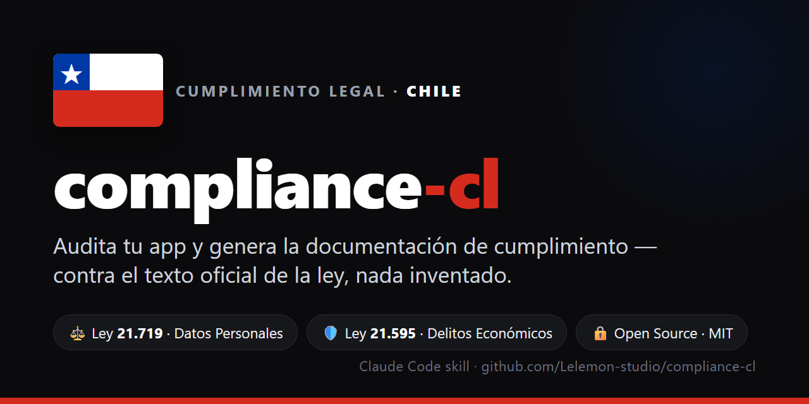

<div align="center">



# compliance-cl

### Cumplimiento de datos para tu SaaS chileno, desde la terminal

Una skill de [Claude Code](https://claude.ai/code) que lee tu código, arma los documentos de
cumplimiento y te deja listo para cumplir **sin abogado**. Cada conclusión apunta al artículo de la ley
que la respalda; el abogado queda como un plus opcional, no como requisito para partir.

[](LICENSE)


</div>

---

## Por qué

La Ley 21.719 de datos entra en vigencia el 1 de diciembre de 2026, con multas de 5.000 a 20.000 UTM
según la gravedad. La Ley 21.595 de delitos económicos ya rige, incluso para una SpA de una persona.
Casi nadie llega preparado.

compliance-cl hace el trabajo completo en una corrida: el inventario, los documentos y el diagnóstico
técnico. La idea es que un founder arme su cumplimiento solo, sin equipo legal ni un estudio cobrándole
varios palos por el trabajo mecánico.

## Qué hace

Corres `/compliance-cl` sobre tu repo y:

1. Te pregunta lo básico: empresa, si eres responsable o encargado de los datos, y qué leyes auditar.
2. Lee el código y mapea qué datos personales guardas y a qué proveedores se van (las transferencias
   fuera de Chile).
3. Evalúa los controles con un catálogo que puntúa varias leyes a la vez.
4. Arma los documentos: RAT, política de privacidad, DPA, plan de brechas, modelo de prevención de
   delitos, código de ética y matriz de riesgos.
5. Guarda el estado en `.compliance/` y lo versiona, así ves qué mejora o qué se rompe entre corridas.
6. Te explica cada decisión con su artículo y trae guías para cuando pase algo: un derecho ARCO, una
   brecha, una fiscalización.
7. **Construye las remediaciones**: como corre en Claude Code, puede implementar los arreglos (MFA,
   cifrado en reposo, audit log, endpoints ARCO, retención) y **montar el monitoreo** (secret scanning,
   HIBP, alertas), siguiendo recetas con librerías verificadas. Ver `references/build/`.

## Marcos cubiertos

| Pack | Ley | Estado | Cubre |
|------|-----|--------|-------|
| `ley-21719` | Protección de Datos Personales | vigencia **1-dic-2026** | consentimiento, derechos ARCO, RAT, DPA, seguridad, brechas, transferencias |
| `ley-21595` | Delitos Económicos (MPD) | **ya vigente** | modelo de prevención, código de ética, matriz de riesgos |
| _próximos_ | GDPR · ISO 27001 · SOC 2 | extensible | agregar un marco es agregar un `pack` |

## Quickstart

```bash
# 1. Instalar (la skill es este repo)
git clone https://github.com/Lelemon-studio/compliance-cl ~/.claude/skills/compliance-cl

# 2. En Claude Code, dentro del repo a auditar:
/compliance-cl
```

## Ejemplo de output

La skill escribe en el repo auditado un estado vivo y versionable:

```text
.compliance/
├── state.json        # postura por marco + estado de cada control (con evidencia archivo:línea)
├── RESUMEN.md        # brechas priorizadas + qué resolviste + diff vs la corrida anterior
├── INSTRUCTIVO.md    # guías: derecho ARCO · brecha · fiscalización · calendario
└── docs/
    ├── 21719-rat.md  21719-politica-privacidad.md  21719-dpa.md  21719-plan-respuesta-brechas.md
    └── 21595-modelo-prevencion-delitos.md  21595-codigo-etica.md  21595-matriz-riesgos.md
```

Cada corrida es un commit, así que git te queda como historial: ves cuándo subió o bajó tu postura y
quién cambió qué.

## Respaldado en la ley

El contenido legal se contrasta contra el texto oficial que viene en [`sources/`](sources/): el PDF del
Diario Oficial y los XML de Ley Chile, con [`FUENTES.md`](sources/FUENTES.md) (URL, `idNorma`, SHA-256 y
el comando para volver a bajarlos). En [`mapa-articulos-21719.md`](references/mapa-articulos-21719.md)
cada artículo está chequeado contra el texto, con la línea donde aparece. Lo que no se puede confirmar
ahí queda marcado como `[verificar contra fuente oficial]`.

## Estructura

```text
SKILL.md                          # el motor (multi-pack, se apoya en sources/)
references/
  controls.md                     # catálogo de controles + crosswalk (un control cubre varias leyes)
  output-model.md                 # formato del estado .compliance/
  cuando-acudir-a-abogado.md      # por qué el abogado es opcional (lo armas tú)
  instructivo-situaciones.md      # guías operativas
  mapa-articulos-21719.md         # artículos chequeados contra el texto oficial
packs/
  ley-21719/  ley-21595/          # obligaciones + plantillas por marco
sources/                          # textos legales oficiales + FUENTES.md (reproducible)
```

## Roadmap

- [ ] Completar el mapa de artículos (transferencias internacionales, MPD/DPO).
- [ ] Packs nuevos: GDPR, ISO 27001, SOC 2.
- [ ] Mejor detección de cambios entre corridas.
- [ ] Revisión legal opcional de las plantillas (un plus, no un requisito).

## Contribuir

Se agradecen issues y PRs, sobre todo packs nuevos, correcciones de artículos chequeadas contra el
texto oficial, y mejoras a las guías. Lee [`CONTRIBUTING.md`](CONTRIBUTING.md).

## Qué no hace

- **Monitoreo / detección de filtraciones en tiempo real** (DLP, alertas 24/7): es un servicio corriendo
  siempre, no una skill on-demand. La skill prepara el plan de respuesta y puede configurar alertas sobre
  el audit log, pero la vigilancia en vivo es otra categoría.
- **Representarte** ante la Agencia o tribunales (eso es de un abogado) ni reemplazar la **supervisión
  externa anual del MPD** (Ley 21.595, la hace un tercero).

No reemplaza a un abogado: te deja listo para cumplir y te dice qué falta.

## Aviso

Esto no es asesoría legal: un software no asume tu responsabilidad legal, la decisión final es tuya. Te
deja listo para cumplir solo. Un abogado es un plus opcional si quieres una revisión, y solo es
imprescindible si te fiscalizan y escala a una disputa (la representación, por ley, la hace un abogado).
Ver [`NOTICE.md`](NOTICE.md).

## Licencia

[MIT](LICENSE) © 2026 Lelemon SpA
