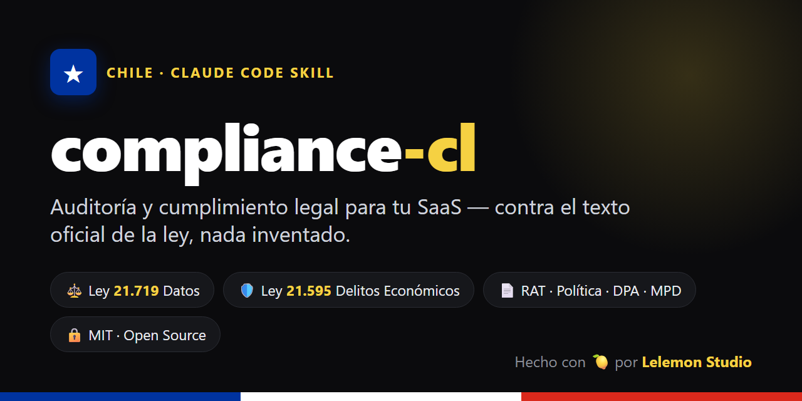

<div align="center">



# ⚖️ compliance-cl

### Auditoría y cumplimiento legal para tu SaaS en Chile — desde tu terminal

Una skill de [Claude Code](https://claude.ai/code) que **lee tu código**, **genera la documentación**
de cumplimiento y te dice **qué necesita abogado y qué no** — todo contrastado contra el **texto
oficial de la ley**, nada inventado.

[](LICENSE)


</div>

---

## ¿Por qué?

La **Ley 21.719** de Protección de Datos entra en vigencia el **1 de diciembre de 2026**, con multas de
hasta **20.000 UTM**. La **Ley 21.595** de Delitos Económicos **ya está vigente** y aplica incluso a una
SpA de una persona. La mayoría de las startups llega sin nada preparado.

`compliance-cl` te lleva del **0 a un esqueleto defendible** en una corrida — sin pagar un estudio para
el trabajo mecánico, dejando al abogado solo lo que de verdad requiere su firma.

## ¿Qué hace?

```text
/compliance-cl
```

1. 🧭 **Te guía** — empresa, rol (responsable / encargado), qué leyes auditar.
2. 🔍 **Lee tu repo** — qué datos personales tocas y a qué proveedores viajan (transferencias).
3. ✅ **Evalúa controles** — un catálogo común que puntúa **varias leyes a la vez** (crosswalk).
4. 📄 **Genera la documentación** — RAT, política de privacidad, DPA, plan de brechas, modelo de
   prevención de delitos, código de ética, matriz de riesgos.
5. 🗂️ **Deja un estado versionado** en `.compliance/` — re-corrible para ver **avance / drift**.
6. 👔 **Te dice qué llevar a abogado** y trae **instructivos** para cada situación (derecho ARCO,
   brecha, fiscalización).

## Marcos cubiertos

| Pack | Ley | Estado | Cubre |
|------|-----|--------|-------|
| `ley-21719` | Protección de Datos Personales | vigencia **1-dic-2026** | consentimiento, derechos ARCO, RAT, DPA, seguridad, brechas, transferencias |
| `ley-21595` | Delitos Económicos (MPD) | **ya vigente** | modelo de prevención, código de ética, matriz de riesgos |
| _próximos_ | GDPR · ISO 27001 · SOC 2 | extensible | agregar un marco = agregar un `pack` |

## Quickstart

```bash
# 1. Instalar (la skill ES este repo)
git clone https://github.com/Lelemon-studio/compliance-cl ~/.claude/skills/compliance-cl

# 2. En Claude Code, dentro del repo a auditar:
/compliance-cl
```

## Ejemplo de output

La skill escribe en el repo auditado un estado vivo y versionable:

```text
.compliance/
├── state.json        # postura por marco + estado de cada control (con evidencia archivo:línea)
├── RESUMEN.md        # brechas priorizadas + "qué llevar a abogado" + diff vs corrida anterior
├── INSTRUCTIVO.md    # runbooks: derecho ARCO · brecha 72h · fiscalización · calendario
└── docs/
    ├── 21719-rat.md  21719-politica-privacidad.md  21719-dpa.md  21719-plan-respuesta-brechas.md
    └── 21595-modelo-prevencion-delitos.md  21595-codigo-etica.md  21595-matriz-riesgos.md
```

> **git = audit trail.** Cada corrida es un commit; la postura sube o baja en el tiempo, con respaldo.

## Nada inventado 🔒

El contenido legal se contrasta contra el **corpus oficial** incluido en [`sources/`](sources/):
PDF del Diario Oficial + XML de Ley Chile, con [`FUENTES.md`](sources/FUENTES.md) (URLs, `idNorma`,
SHA-256, comando de re-descarga) y [`mapa-articulos-21719.md`](references/mapa-articulos-21719.md)
(artículos verificados línea por línea). Toda afirmación cita **ley + artículo + archivo**; lo no
verificable se marca `[verificar contra fuente oficial]`.

## Estructura

```text
SKILL.md                          # el motor (multi-pack, grounding contra sources/)
references/
  controls.md                     # catálogo de controles + crosswalk (1 control → varias leyes)
  output-model.md                 # formato del estado .compliance/
  cuando-acudir-a-abogado.md      # qué resuelves solo vs qué necesita abogado
  instructivo-situaciones.md      # runbooks operativos
  mapa-articulos-21719.md         # artículos verificados contra el texto oficial
packs/
  ley-21719/  ley-21595/          # obligaciones + plantillas por marco
sources/                          # textos legales oficiales + FUENTES.md (reproducible)
```

## Roadmap

- [ ] Completar el mapa de artículos verificado (transferencias internacionales, MPD/DPO).
- [ ] Packs nuevos: GDPR, ISO 27001, SOC 2.
- [ ] Detección de drift más fina en la re-corrida.
- [ ] Validación legal de las plantillas por un abogado.

## Contribuir

Issues y PRs bienvenidos — sobre todo nuevos packs, correcciones de artículos **contrastadas contra el
texto oficial**, y mejoras a los runbooks. Lee [`CONTRIBUTING.md`](CONTRIBUTING.md).

## ⚠️ Aviso

**No es asesoría legal.** Genera borradores y diagnósticos para acelerar tu cumplimiento; valida los
resultados con un abogado antes de publicar políticas, firmar contratos o presentarte ante la autoridad.
Ver [`NOTICE.md`](NOTICE.md).

## Licencia

[MIT](LICENSE) © 2026 [Lelemon SpA](https://lelemon.cl)

<div align="center"><sub>Hecho con 🍋 por Lelemon Studio</sub></div>
